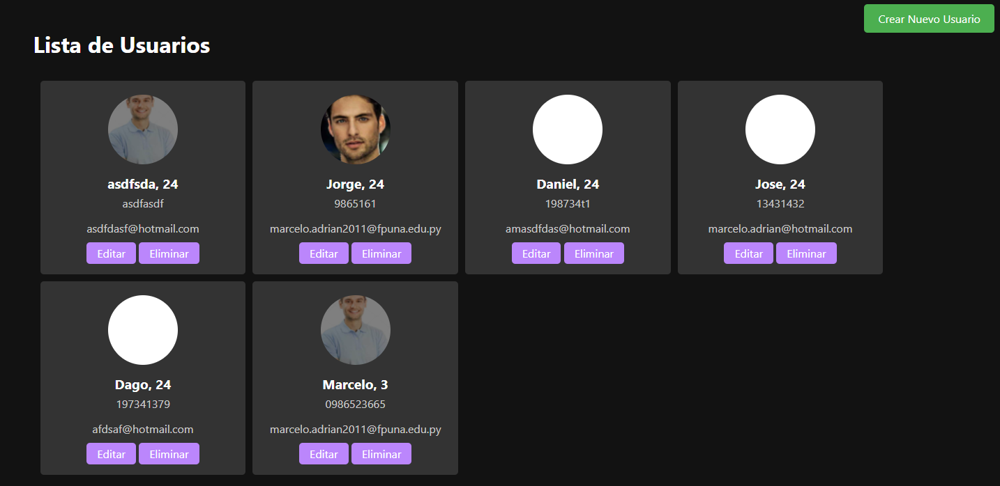

# Sistema de Gestión de Usuarios en Django

Este proyecto es un sistema de gestión de usuarios construido con Django. Permite a los usuarios registrarse con una foto de perfil, nombre, correo electrónico, teléfono y fecha de nacimiento. Además, proporciona funcionalidad CRUD (Crear, Leer, Actualizar, Eliminar) para gestionar usuarios.

## Características

- CRUD completo para usuarios.
- Subida y manejo de fotos de perfil.
- Cálculo automático de la edad a partir de la fecha de nacimiento.
- Interfaz estilizada con modo oscuro.

## Requisitos Previos

Necesitarás Python 3.6+ y pip instalados en tu sistema para ejecutar este proyecto.

## Configuración Inicial

Sigue estos pasos para configurar el proyecto en tu entorno local.

### Clonar el Repositorio

Clona este repositorio a tu máquina local usando:

```bash
git clone https://github.com/Marceeaax/CodysCRUD
```

### Configurar el Entorno Virtual

Para aislar las dependencias del proyecto, es recomendable utilizar un entorno virtual. Puedes crear uno utilizando:

```bash
python -m venv venv
```

Luego activa el entorno virtual, descarga las dependencias utilizando 

```bash
pip install -r requirements.txt
```

Luego ejecuta los siguientes comandos

```bash
python manage.py makemigrations
python manage.py migrate
python manage.py runserver
```

Ahora, puedes acceder al proyecto en `http://127.0.0.1:8000/` desde tu navegador.
